# Multi-Agent Navigation in Unconstrained Environments using a Centralized Attention-based Graph Neural Network Controller

[](https://arxiv.org/abs/2307.16727)
[](https://doi.org/10.1109/ITSC57777.2023.10422072)
[](https://yininghase.github.io/multi-agent-control/)

**Yining Ma, Qadeer Khan and Daniel Cremers — IEEE ITSC 2023**

[Project Page](https://yininghase.github.io/multi-agent-control/) | [arXiv](https://arxiv.org/abs/2307.16727) | [IEEE Xplore](https://doi.org/10.1109/ITSC57777.2023.10422072)

> Check out our follow-up work [MA-DV2F](https://yininghase.github.io/MA-DV2F/) with improved performance.

---

## TL;DR

A PyTorch implementation of a centralized Graph Neural Network controller with a U-Net inspired attention mechanism for collision-free multi-vehicle navigation, trained on labels generated by Model Predictive Control (MPC) optimization.

---

## Overview

This repository contains the code for our IEEE ITSC 2023 paper. We address the problem of navigating multiple vehicles simultaneously in cluttered, unconstrained environments. Each vehicle must reach a desired target pose while avoiding collisions with both other vehicles and static obstacles.

Our method uses a **centralized learning-based controller**. At every timestep, a single Graph Neural Network (GNN) observes the state of all vehicles and obstacles and outputs control commands (pedal/throttle and steering angle) for every vehicle. The network is trained in a supervised fashion on ground-truth control labels produced by an MPC optimizer. A key contribution is a **U-Net inspired attention block** that lets each vehicle attend to other agents and obstacles at multiple scales, enabling smooth and collision-free trajectories.

A notable strength of the model is **generalization**: it is trained on scenarios with up to 3 vehicles and 4 obstacles, yet it generalizes to test cases with up to 6 vehicles and 2 obstacles.

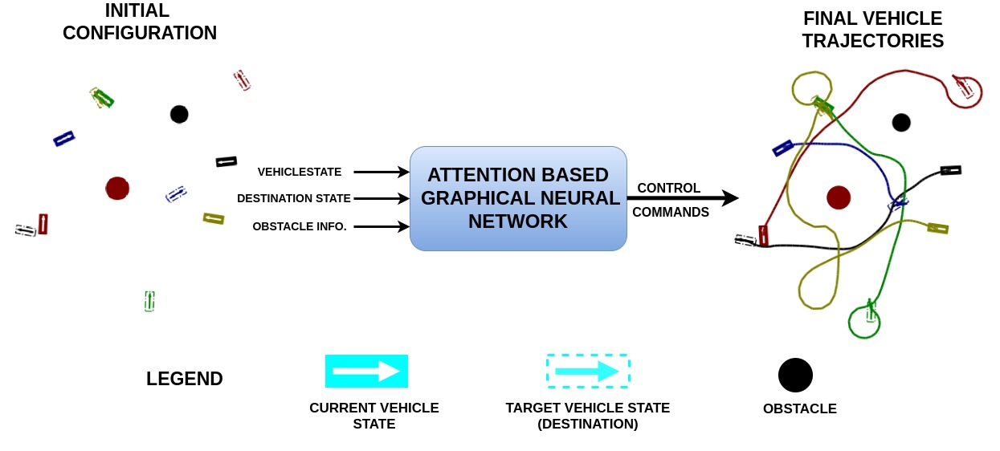

---

## Architecture

### U-Attention Block

The U-Attention block combines ideas from TransformerConv and EdgeConv. It uses shared encoder weights from a U-Net architecture to compute attention-aware messages between graph nodes, and adds learnable skip connections for stable optimization. For the full mathematical formulation, please see [supplementary.pdf](./supplementary.pdf).

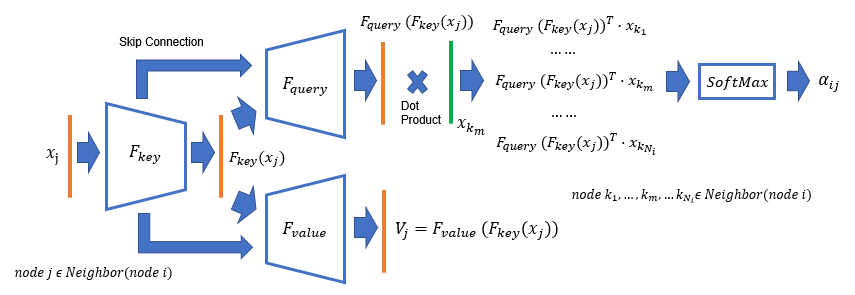

### Full Model

The `IterativeGNNModel` (`gnn.py`) follows an encoder-decoder structure:

1. **Input encoding**: raw vehicle/obstacle features are embedded to a hidden dimension.
2. **Two Conv-Residual blocks**: each block applies the selected graph convolution (UAttentionConv, TransformerConv, EdgeConv, or GAINet) followed by residual connections and batch normalization.
3. **Decoder**: maps node features to control outputs `[pedal, steering]` with a `tanh` activation and bounded output scaling.

During inference, the model is applied auto-regressively: it predicts controls for the current state, integrates the bicycle-dynamics model forward, and repeats until all vehicles reach their goals or the simulation horizon is exhausted.

---

## Results

### Scenario Demonstrations

The GIFs below show four different test scenarios. The model navigates all vehicles to their destinations without collisions.

<table>
  <tr>
    <td align="center">Scenario 1</td>
    <td align="center">Scenario 2</td>
  </tr>
  <tr>
    <td>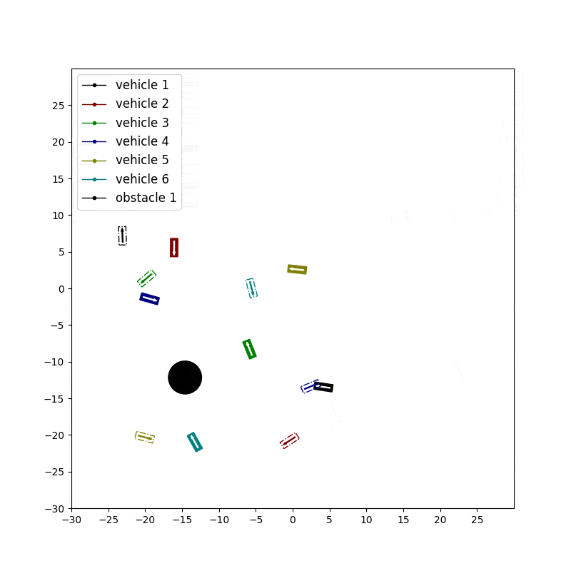</td>
    <td>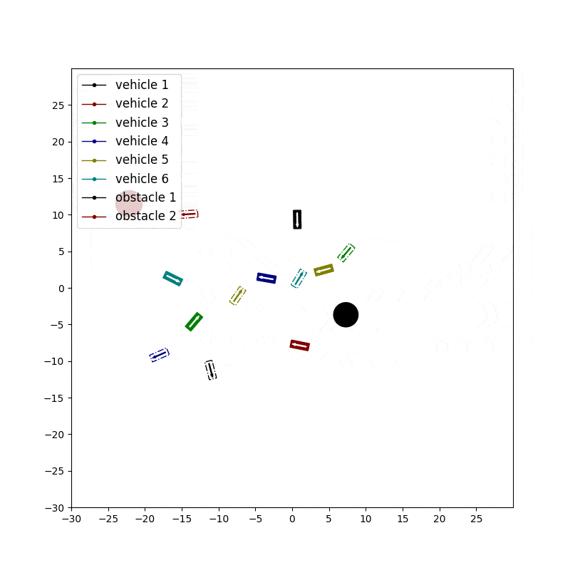</td>
  </tr>
  <tr>
    <td align="center">Scenario 3</td>
    <td align="center">Scenario 4</td>
  </tr>
  <tr>
    <td></td>
    <td></td>
  </tr>
</table>

### Attention Visualization

The GIF below visualizes the mean attention logits across all graph attention layers. Rows correspond to the vehicle of interest; columns show which vehicle or obstacle is being attended to. Lighter shades indicate higher attention; darker shades indicate lower attention.

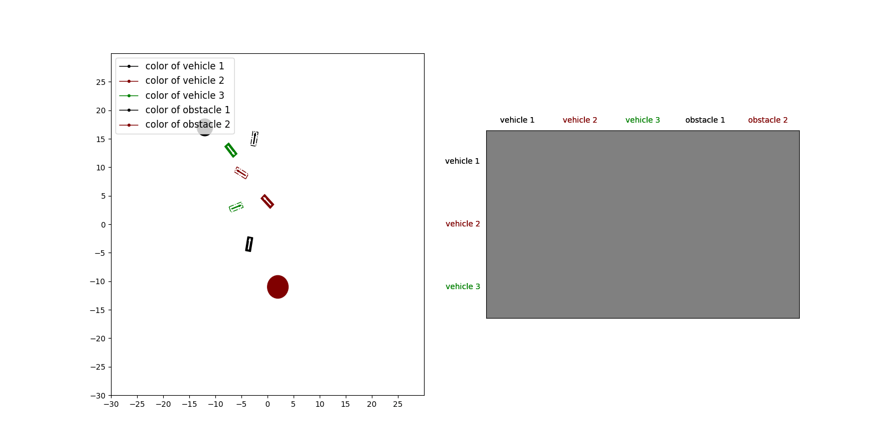

### Comparison with Baselines

We compare our model against **GAINet** [1], **TransformerConv** [2], **EdgeConv** [3], and a **No-Graph** MLP baseline. Only our model successfully drives all vehicles to their targets without collisions.

**Scenario 1**

| Our Model | GAINet | TransformerConv | EdgeConv | No Graph |
|:---------:|:------:|:---------------:|:--------:|:--------:|
|  | 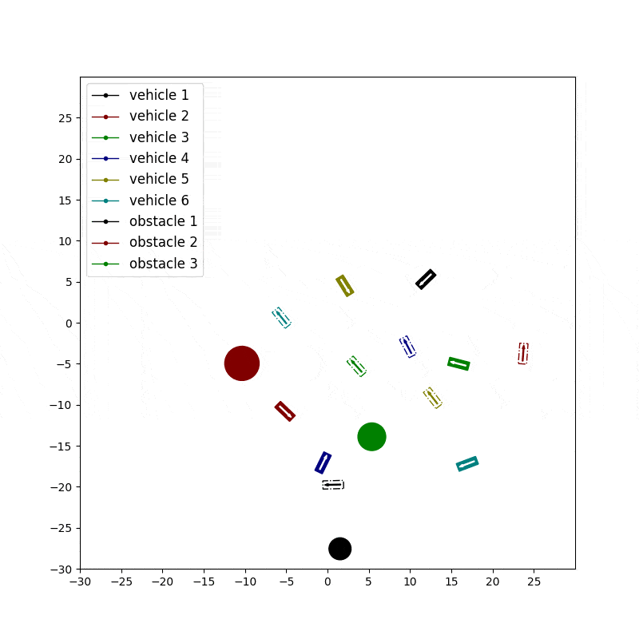 | 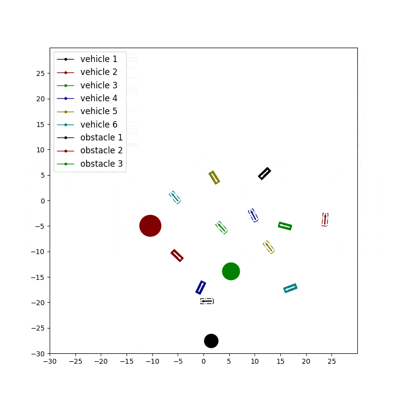 | 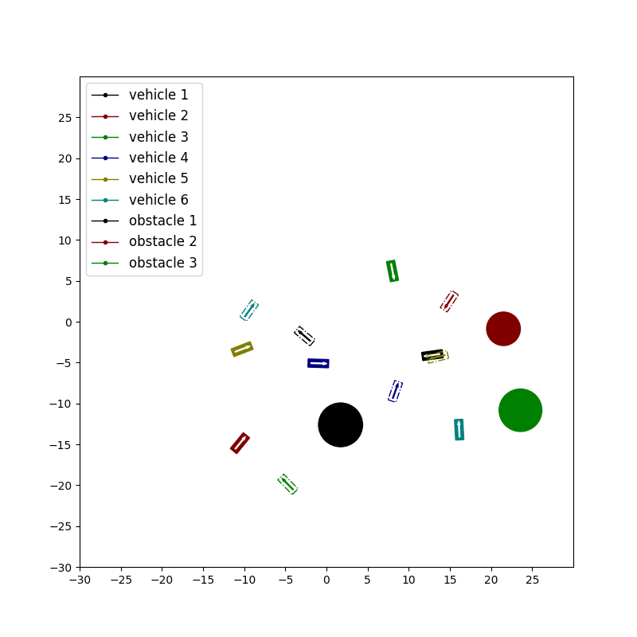 |  |

**Scenario 2**

| Our Model | GAINet | TransformerConv | EdgeConv | No Graph |
|:---------:|:------:|:---------------:|:--------:|:--------:|
|  | 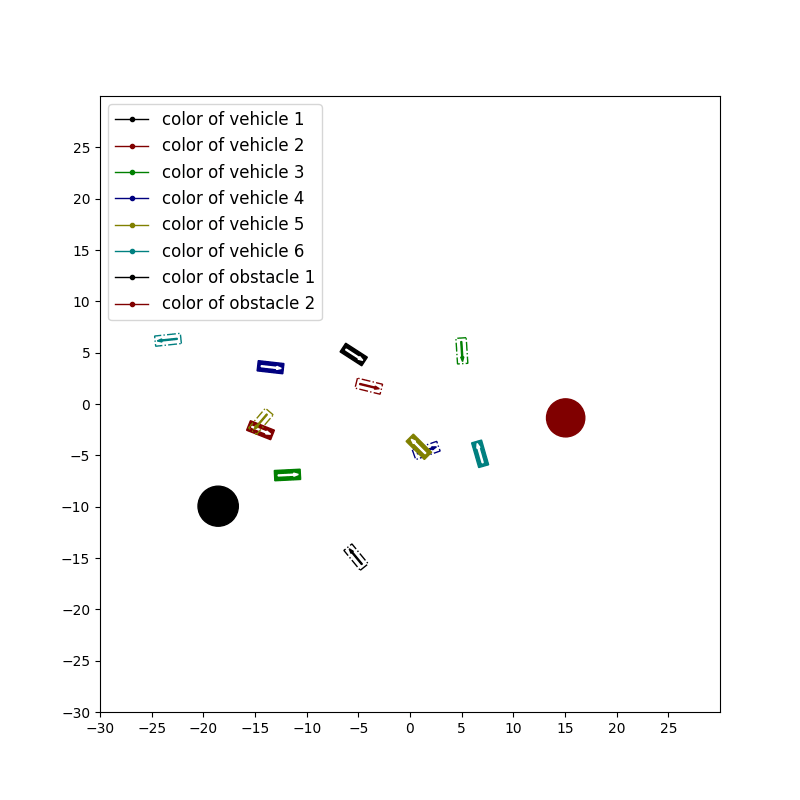 |  | 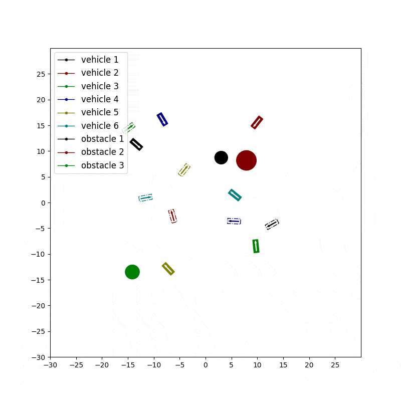 |  |

### Quantitative Highlights

On a held-out test set with up to 6 vehicles and 2 obstacles (combinations marked with `*` were never seen during training), our model achieves high success-to-goal rates and low collision rates. For detailed numbers, please refer to Table II in [supplementary.pdf](./supplementary.pdf).

---

## Repository Structure

```text
.
├── configs/                    # YAML configuration files for all scripts
│   ├── train.yaml
│   ├── inference.yaml
│   ├── calculate_metrics.yaml
│   ├── generate_trainval_data.yaml
│   ├── generate_test_data.yaml
│   └── visualize_attention.yaml
├── data/                       # Generated datasets (created by scripts)
│   ├── trainval_dataset/
│   ├── test_dataset/
│   └── prediction/
├── images/                     # README assets (GIFs, diagrams)
├── models/                     # Saved model checkpoints
├── calculate_metrics.py        # Evaluation: success rate, collision rate, efficiency
├── data_process.py             # Data loading, preprocessing, dataset splits
├── generate_test_dataset.py    # Generate fixed test scenarios
├── generate_trainval_data.py   # Generate training data via MPC optimization
├── gnn.py                      # IterativeGNNModel and ConvResidualBlock
├── inference.py                # Run trained model on test data
├── loss.py                     # Weighted MSE loss with horizon weighting
├── mpc.py                      # Model Predictive Control for label generation
├── simulation.py               # Closed-loop simulation engine
├── train.py                    # Training script with early stopping
├── u_attention_conv.py         # U-Attention graph convolution layer
├── visualization.py            # Trajectory and attention animation tools (imported by other scripts)
├── visualize_attention.py      # Interactive attention visualization GUI
├── LICENSE                     # MIT License
├── README.md                   # This file
├── requirements.txt            # Python dependencies
└── supplementary.pdf           # Additional ablation studies and details
```

---

## Installation

### Requirements

- Python 3.7 or newer
- CUDA 11.3 compatible GPU (recommended; CPU fallback is supported but slow)
- At least 8 GB of GPU memory for training with the default batch size of 4096

### Conda Environment

If your shell is not yet configured for `conda activate`, run `conda init bash` first and restart the terminal.

```bash
conda create -n multiagent python=3.7
conda activate multiagent

# PyTorch 1.11.0 with CUDA 11.3
pip install torch==1.11.0+cu113 torchvision==0.12.0+cu113 torchaudio==0.11.0+cu113 \
    -f https://download.pytorch.org/whl/torch_stable.html

# PyTorch Geometric 2.0.4 dependencies
pip install --no-index torch-scatter --no-cache-dir \
    -f https://pytorch-geometric.com/whl/torch-1.11.0+cu113.html
pip install --no-index torch-sparse --no-cache-dir \
    -f https://pytorch-geometric.com/whl/torch-1.11.0+cu113.html
pip install --no-index torch-cluster --no-cache-dir \
    -f https://pytorch-geometric.com/whl/torch-1.11.0+cu113.html
pip install --no-index torch-spline-conv --no-cache-dir \
    -f https://pytorch-geometric.com/whl/torch-1.11.0+cu113.html
pip install torch-geometric==2.0.4

# Other dependencies
pip install scipy matplotlib pyyaml tqdm scikit-learn
```

For other PyTorch / CUDA versions, please refer to the [PyTorch Geometric installation guide](https://pytorch-geometric.readthedocs.io/en/latest/install/installation.html).

### Quick Verification

```bash
python -c "import torch; import torch_geometric; print('CUDA:', torch.cuda.is_available())"
```

Alternatively, install from `requirements.txt`:

```bash
pip install -r requirements.txt
```

Note: `requirements.txt` lists the standard PyPI packages. You may still need to install the PyTorch and PyTorch Geometric wheels manually for your specific CUDA version.

---

## Quick Start

A pretrained checkpoint is included in the repository. You can run inference immediately:

```bash
conda activate multiagent
cd /path/to/multi-agent-control
python inference.py --config_path ./configs/inference.yaml
```

By default, this generates random test cases on the fly for the configurations listed in `configs/inference.yaml`. Predictions and trajectory plots are saved to `./data/prediction/` and `./plots/prediction/`.

---

## Full Pipeline

The complete workflow is:

```text
MPC Data Generation -> Training -> Inference -> Metrics -> Visualization
(generate_trainval_data.py)  (train.py)  (inference.py)  (calculate_metrics.py)  (visualization.py)
```

### 1. Data Generation

Training labels are generated by solving MPC optimization problems. This step is CPU-intensive and can take several hours.

```bash
python generate_trainval_data.py --config_path ./configs/generate_trainval_data.yaml
```

Key settings in `configs/generate_trainval_data.yaml`:

- `simulation runs`: total number of MPC rollouts
- `horizon`: MPC prediction horizon (default 15)
- `problem collection`: list of `[num_vehicles, num_obstacles]` pairs to generate
- `random offset`: adds perturbations for more robust training data (recommended `True`)
- `data folder`: where `.pt` files are saved

We also provide a pre-generated dataset:

- [Training/validation data](https://cvg.cit.tum.de/webshare/g/papers/khamuham/multiagent-data/trainval_dataset.zip)
- [Test data](https://cvg.cit.tum.de/webshare/g/papers/khamuham/multiagent-data/test_dataset.zip)

### 2. Training

```bash
python train.py --config_path ./configs/train.yaml
```

Key settings in `configs/train.yaml`:

- `train max epochs`, `batch size`, `initial learning rate`
- `number of vehicles`, `num of obstacles`: maximum counts; the loader also includes all simpler cases automatically
- `data folder`: directories containing the generated training data
- `model name`, `model folder`: where to save the checkpoint
- `convolution type`: choose `UAttentionConv`, `TransformerConv`, `EdgeConv`, or `GAINet`
- `pretrained model`: path to resume training (optional)

The best model is saved as `./models/{model_name}/{model_name}.pth`. Training logs and a learning-curve plot are saved alongside it.

### 3. Test Data Generation (Optional)

For reproducible evaluation, generate a fixed test dataset:

```bash
python generate_test_dataset.py --config_path ./configs/generate_test_data.yaml
```

Each `[vehicles, obstacles]` pair is saved as `data/test_dataset/test_data_vehicle={i}_obstacle={j}.pt`.

### 4. Inference

```bash
python inference.py --config_path ./configs/inference.yaml
```

Key settings in `configs/inference.yaml`:

- `model path`: path to the trained checkpoint
- `convolution type`: must match the trained model
- `test data souce`: `on the fly` for random cases or `fixed test data` for reproducible evaluation
- `problem collection`: which scenarios to run
- `collect data`, `collect trajectory`: must be `True` if you plan to calculate metrics

To test step efficiency, run inference with `convolution type` set to `{Network}_NoVehicleEdges` and compare the outputs using `calculate_metrics.py`.

### 5. Evaluation

```bash
python calculate_metrics.py --config_path ./configs/calculate_metrics.yaml
```

This computes:

- Success rate (reaching the goal without collision)
- Collision rate
- Travel distance
- Trajectory efficiency (straight-line distance / actual traveled distance)
- Step efficiency (parallel vs sequential processing comparison)

### 6. Visualization

Trajectory animations and plots are generated automatically during inference when `save plot: True` is set in `configs/inference.yaml`. They are saved to `./plots/prediction/`.

Run the interactive attention visualization tool:

```bash
python visualize_attention.py --config_path ./configs/visualize_attention.yaml
```

---

## Configuration Guide

Every script is controlled by a YAML config file and a single `--config_path` argument.

| Config | Script | Purpose |
|--------|--------|---------|
| `generate_trainval_data.yaml` | `generate_trainval_data.py` | Generate training/validation data via MPC |
| `generate_test_data.yaml` | `generate_test_dataset.py` | Generate fixed test scenarios |
| `train.yaml` | `train.py` | Train the GNN model |
| `inference.yaml` | `inference.py` | Run inference with a trained model |
| `calculate_metrics.yaml` | `calculate_metrics.py` | Compute success/collision/efficiency metrics |
| `visualize_attention.yaml` | `visualize_attention.py` | Interactive attention visualization |

Common parameters:

- `problem collection`: list of `[num_vehicles, num_obstacles]` pairs to process.
- `horizon`: keep `1` for all GNN scripts (`train.py`, `inference.py`, `visualize_attention.py`); use `15` or more for MPC data generation.
- `convolution type`: choose from `UAttentionConv`, `TransformerConv`, `EdgeConv`, or `GAINet`. Use `{Network}_NoVehicleEdges` for the step-efficiency ablation.

---

## Data Structure

After running the generation scripts, the `data/` directory looks like this:

```text
data/
├── trainval_dataset/
│   └── data_generation_1/
│       ├── batches_data_vehicle={i}_obstacle={j}.pt
│       ├── X_data_vehicle={i}_obstacle={j}.pt
│       ├── y_GT_data_vehicle={i}_obstacle={j}.pt
│       └── trajectory_data_vehicle={i}_obstacle={j}.pt  # optional
├── test_dataset/
│   └── test_data_vehicle={i}_obstacle={j}.pt
└── prediction/
    └── {MODEL_NAME}/
        ├── batches_data_vehicle={i}_obstacle={j}.pt
        ├── X_data_vehicle={i}_obstacle={j}.pt
        ├── y_model_data_vehicle={i}_obstacle={j}.pt
        └── trajectory_data_vehicle={i}_obstacle={j}.pt
```

File contents:

- `X_data_*.pt`: input node features. Each node is an 8-dimensional vector. Vehicles are marked with `0` in the last channel; obstacles are marked with `1`.
- `y_GT_data_*.pt`: ground-truth controls `[pedal, steering]` from MPC.
- `y_model_data_*.pt`: model-predicted controls.
- `batches_data_*.pt`: graph batch indices and the number of vehicles per problem.
- `trajectory_data_*.pt`: trajectory indices used for metric calculation.

You do not need to create these files manually; they are generated automatically by the scripts.

---

## Pretrained Models

The repository includes a pretrained checkpoint:

- `models/IterGNN_UAttentionConv.pth`: trained on scenarios with up to 3 vehicles and 4 obstacles using the UAttentionConv layer.

To use it, set the following in `configs/inference.yaml`:

```yaml
convolution type: UAttentionConv
model path: ./models/IterGNN_UAttentionConv.pth
```

---

## Interactive Attention Visualization

Launch the interactive tool to inspect attention weights:

```bash
python visualize_attention.py --config_path ./configs/visualize_attention.yaml
```

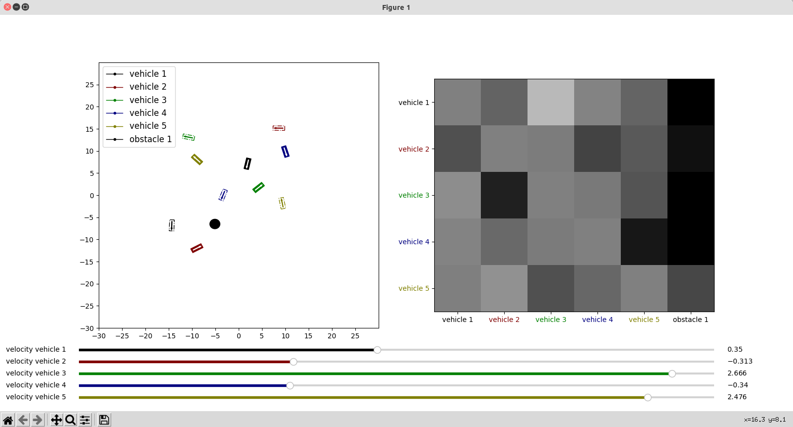

Controls:

- **Move vehicle / destination / obstacle**: left-click and drag.
- **Rotate vehicle / destination**: left-click and scroll.
- **Change vehicle velocity**: drag the corresponding slider.
- **Resize obstacle**: left-click and scroll.

The number of vehicles and obstacles can be changed in `configs/visualize_attention.yaml` under `problem collection`.

---

## Supplementary Material

Additional details are provided in [supplementary.pdf](./supplementary.pdf):

- Details of the U-Net inspired attention mechanism
- Ablation studies on the contribution of different model components
- Runtime comparison
- Breakdown of the training data
- Conservative optimization behavior

---

## Citation

If you find this work useful, please cite:

```bibtex
@INPROCEEDINGS{10422072,
  author={Ma, Yining and Khan, Qadeer and Cremers, Daniel},
  booktitle={2023 IEEE 26th International Conference on Intelligent Transportation Systems (ITSC)},
  title={Multi Agent Navigation in Unconstrained Environments using a Centralized Attention based Graphical Neural Network Controller},
  year={2023},
  volume={},
  number={},
  pages={2893-2900},
  keywords={Training;Codes;Navigation;Neural networks;Training data;Data models;Optimization},
  doi={10.1109/ITSC57777.2023.10422072}}
```

Plain text:

> Y. Ma, Q. Khan and D. Cremers, "Multi Agent Navigation in Unconstrained Environments using a Centralized Attention based Graphical Neural Network Controller," *2023 IEEE 26th International Conference on Intelligent Transportation Systems (ITSC)*, pp. 2893-2900, 2023, doi: 10.1109/ITSC57777.2023.10422072.

---

## References

[1] Liu, Y., Qi, X., Sisbot, E. A., and Oguchi, K. **Multi-agent trajectory prediction with graph attention isomorphism neural network**. In *2022 IEEE Intelligent Vehicles Symposium (IV)*, pp. 273–279, 2022. doi: 10.1109/IV51971.2022.9827155.

[2] Shi, Y., Huang, Z., Feng, S., Zhong, H., Wang, W., and Sun, Y. **Masked label prediction: Unified message passing model for semi-supervised classification**. arXiv preprint arXiv:2009.03509, 2020.

[3] Yue, W., Yongbin, S., Ziwei, L., Sarma, S. E., and Bronstein, M. M. **Dynamic graph CNN for learning on point clouds**. *ACM Transactions on Graphics (TOG)*, 38(5), 2019.

---

## Acknowledgements

We thank [Marc Brede](https://github.com/MarcBrede/trajectory_prediction) for helping with the initial setup of the label generation process in the early phase of the project.

We thank the open-source codebase [mpc-course-assignments](https://github.com/WuStangDan/mpc-course-assignments).

---

## License

This project is licensed under the [MIT License](./LICENSE).

Copyright (c) 2023 Yining Ma, Qadeer Khan, Daniel Cremers.
