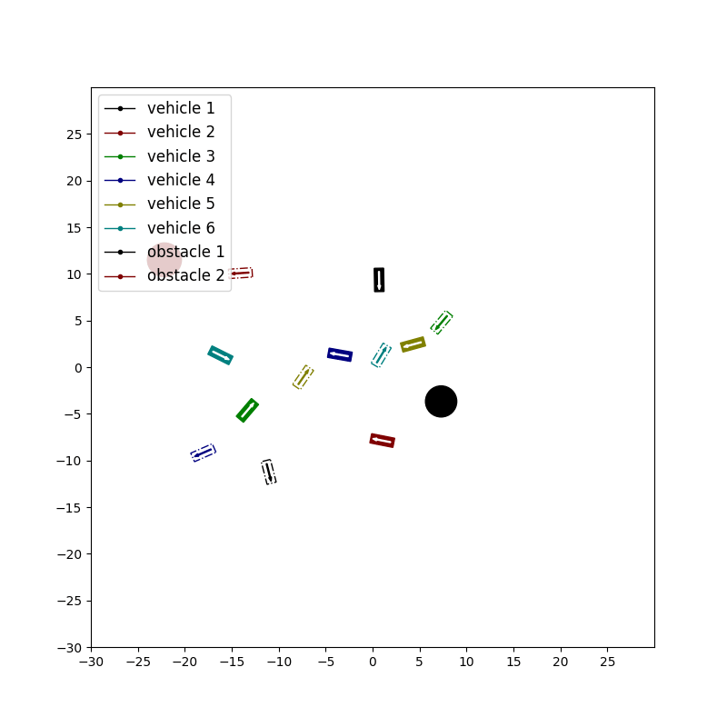

#  Multi-Agent-Control
## Multi-Agent Control in Unconstrained Environments using an Attention basedGraphical Neural Network

This repository contains code for the paper **Multi-Agent Control in Unconstrained Environments using an Attention basedGraphical Neural Network** 

In this work, we propose a learning based neuralmodel that provides control commands to simul-taneously navigate multiple vehicles.  The goalis to ensure that each vehicle reaches a desiredtarget state without colliding with any other vehi-cle or obstacle in an unconstrained environment.The model utilizes an attention based GraphicalNeural Network paradigm that takes into consid-eration the state of all the surrounding vehicles tomake an informed decision. This allows each vehicle to smoothly reach its destination while alsoevading collision with the other agents. The dataand corresponding labels for training such a net-work is obtained using an optimization based pro-cedure.  Experimental results demonstrates thatour model is powerful enough to generalize evento situations with more vehicles than in the train-ing data. Our method also outperforms compara-ble graphical neural network architectures.


## Environment

Clone the repo and build the conda environment:

```
conda create -n myenv python=3.7 
conda activate myenv
pip install torch==1.11.0+cu113 torchvision==0.12.0+cu113 torchaudio==0.11.0+cu113 -f https://download.pytorch.org/whl/torch_stable.html
pip install --no-index torch-scatter --no-cache-dir -f https://pytorch-geometric.com/whl/torch-1.11.0+cu113.html
pip install scipy
pip install --no-index torch-sparse --no-cache-dir -f https://pytorch-geometric.com/whl/torch-1.11.0+cu113.html
pip install --no-index torch-cluster --no-cache-dir -f https://pytorch-geometric.com/whl/torch-1.11.0+cu113.html
pip install --no-index torch-spline-conv --no-cache-dir -f https://pytorch-geometric.com/whl/torch-1.11.0+cu113.html
pip install torch-geometric==2.0.4
pip install pyyaml
pip install matplotlib
```

## Results

Here we show videos to show the qualitative results of our approach **in different settings**. 

<table>
  <tr>
    <td>
      
    </td>
    <td>
      
    </td>
  </tr>
</table>

<table>
  <tr>
    <td>
      
    </td>
    <td>
      
    </td>
  </tr>
</table>


### Show Attention


## Tool for Visualizing Attention 

Run visualize_attention.py:
```
conda activate myenv
cd $path to this repo$
python visualize_attention.py
```
A window will pump out:


Clicking and draging the vehicle or target can change the position of it. 
Clicking and scrolling the vehicle or target can change the orientation of it.
Moving the slider on the bar can change the corresponding velocity of the vehicle.

Clicking and draging the obstacle can change the position of it.
Clicking and scrolling the obstacle can change the size of it.

You can also change the number of vehicle and num of obstacle in the scene by modifying the problem collection in "config/visualize_attention.yaml"

