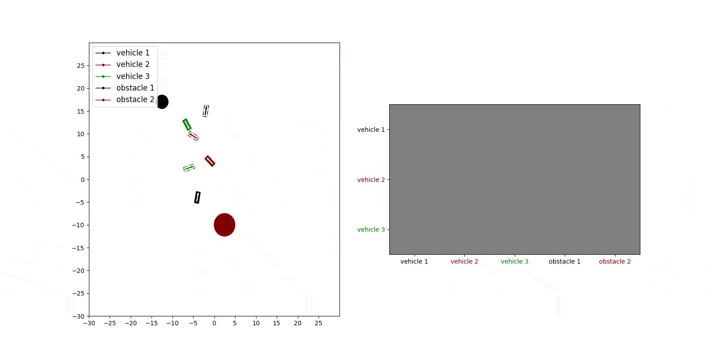

# Multi Agent Navigation in Unconstrained Environments using a Centralized Attention based Graphical Neural Network Controller

**Yining Ma, Qadeer Khan and Daniel Cremers – IEEE ITSC 2023**


[Project](https://yininghase.github.io/multi-agent-control/) | [ArXiv](https://arxiv.org/abs/2307.16727)


This repository contains code for the paper **Multi Agent Navigation in Unconstrained Environments using a Centralized Attention based Graphical Neural Network Controller** 

In this work, we propose a learning based neural model that provides control commands to simultaneously navigate multiple vehicles. The goal is to ensure that each vehicle reaches a desired target state without colliding with any other vehicle or obstacle in an unconstrained environment. The model utilizes an attention based Graphical Neural Network paradigm that takes into consideration the state of all the surrounding vehicles to make an informed decision. This allows each vehicle to smoothly reach its destination while also evading collision with the other agents. The data and corresponding labels for training such a network is obtained using an optimization based procedure. Experimental results demonstrates that our model is powerful enough to generalize even to situations with more vehicles than in the training data. Our method also outperforms comparable graphical neural network architectures.


## U Attention Block 

Here we show our proposed U Attention Block. Please refer to [here](./supplementary.pdf) for the detailed explanation of U Attention Block.


## Results of our Model 

Here we show results of our model in 4 different scenarios.

<table style="table-layout: fixed; word-break: break-all; word-wrap: break-word;" width="100%">
  <tr>
    <td width="50%">
        <text>
          Scenario 1    
        </text>
    </td>
    <td width="50%">
       <text>
          Scenario 2    
        </text>
    </td>
  </tr>
  <tr>
    <td>
      
    </td>
    <td>
      
    </td>
  </tr>
  <tr>
    <td width="50%">
        <text>
          Scenario 3    
        </text>
    </td>
    <td width="50%">
       <text>
          Scenario 4    
        </text>
    </td>
  </tr>
  <tr>
    <td>
      
    </td>
    <td>
      
    </td>
  </tr>
</table>


### Attention Mechanism of our Model

The GIF below shows how the attention changes when the vehicles are moving. We visualize the mean of attention logits from all the graph attention layers of our model. The rows in the attention matrix correspond to the vehicle of interest. The columns show which vehicles/obstacle is being attended to. A lighter shade in the attention matrix depicts high attention and a darker shade represents lack of attention.




### Comparison with Other Models

Here we show the comparison of our result with  **GAINet**[1] **TransformerConv**[2], **EdgeConv**[3] and **naive MLP model without graphical edge in the structure** for two different scenarios.

As can be seen, only our model is capable of simultaneously driving all the vehicles to their desired destinations without collision. For all other models, the vehicles collide with each other. 


**Scenario 1**:

<table style="table-layout: fixed; word-break: break-all; word-wrap: break-word;" width="100%">
  <tr>
    <td width="50%">
        <text>
          <strong>Our Model</strong>      
        </text>
    </td>
  </tr>
  <tr>
    <td width="50%">
        <figure>
            
        </figure>
    </td>
  </tr>
</table>
<table style="table-layout: fixed; word-break: break-all; word-wrap: break-word;" width="100%">
  <tr>
    <td width="50%">
        <text>
        GAINet         
        </text> 
    </td>
    <td width="50%">
        <text>
        TransformerConv
        </text>
    </td>
  </tr>
  <tr>
    <td width="50%">
        <figure>
            
        </figure>
    </td>
    <td width="50%">
        <figure>
            
        </figure>
    </td>
  </tr>
  <tr>
    <td width="50%">
        <text>
        EdgeConv        
        </text>
    </td>
    <td width="50%">
        <text>
        No Graph        
        </text>
    </td>
  </tr>
  <tr>
    <td width="50%">
        <figure>
            
        </figure>
    </td>
    <td width="50%">
        <figure>
            
        </figure>
    </td>
  </tr>
</table>


**Scenario 2**:

<table style="table-layout: fixed; word-break: break-all; word-wrap: break-word;" width="100%">
  <tr>
    <td width="50%">
        <text>
          <strong>Our Model</strong>      
        </text>
    </td>
  </tr>
  <tr>
    <td width="50%">
        <figure>
            
        </figure>
    </td>
  </tr>
</table>
<table style="table-layout: fixed; word-break: break-all; word-wrap: break-word;" width="100%">
  <tr>
    <td width="50%">
        <text>
        GAINet         
        </text> 
    </td>
    <td width="50%">
        <text>
        TransformerConv
        </text>
    </td>
  </tr>
  <tr>
    <td width="50%">
        <figure>
            
        </figure>
    </td>
    <td width="50%">
        <figure>
            
        </figure>
    </td>
  </tr>
  <tr>
    <td width="50%">
        <text>
        EdgeConv        
        </text>
    </td>
    <td width="50%">
        <text>
        No Graph        
        </text>
    </td>
  </tr>
  <tr>
    <td width="50%">
        <figure>
            
        </figure>
    </td>
    <td width="50%">
        <figure>
            
        </figure>
    </td>
  </tr>
</table>


[1]: Liu, Y., Qi, X., Sisbot, E. A., and Oguchi, K. **Multi-agent trajectory prediction with graph attention isomorphismneural network**. In 2022 IEEE Intelligent Vehicles Symposium (IV), pp. 273–279, 2022. doi: 10.1109/IV51971.2022.9827155.

[2]: Shi, Y., Huang, Z., Feng, S., Zhong, H., Wang, W., and Sun,Y. **Masked label prediction:  Unified message passing model for semi-supervised classification**. arXiv preprint arXiv:2009.03509, 2020.

[3]: Yue, W., Yongbin, S., Ziwei, L., Sarma, S. E., and Bronstein, M. M. **Dynamic graph cnn for learning on point clouds**. Acm Transactions On Graphics (tog), 38(5), 2019.


## Environment

Clone the repo and build the conda environment:
```
conda create -n <env_name> python=3.7 
conda activate <env_name>
pip install torch==1.11.0+cu113 torchvision==0.12.0+cu113 torchaudio==0.11.0+cu113 -f https://download.pytorch.org/whl/torch_stable.html
pip install --no-index torch-scatter --no-cache-dir -f https://pytorch-geometric.com/whl/torch-1.11.0+cu113.html
pip install scipy
pip install --no-index torch-sparse --no-cache-dir -f https://pytorch-geometric.com/whl/torch-1.11.0+cu113.html
pip install --no-index torch-cluster --no-cache-dir -f https://pytorch-geometric.com/whl/torch-1.11.0+cu113.html
pip install --no-index torch-spline-conv --no-cache-dir -f https://pytorch-geometric.com/whl/torch-1.11.0+cu113.html
pip install torch-geometric==2.0.4
pip install pyyaml
pip install matplotlib
```


## Data Structure

Please organize the data structure as follows:
```
root
|
data
|-- trainval_dataset
|   |-- data_generation_1
|   |   |-- batches_data_vehicle={i}_obstalce={j}.pt
|   |   |-- X_data_vehicle={i}_obstalce={j}.pt
|   |   |-- y_GT_data_vehicle={i}_obstalce={j}.pt
|   |   |-- trajectory_data_data_vehicle={i}_obstalce={j}.pt (not neccesary for trainval dataset)
|   |   |-- ...
|   |-- data_generation_2
|   |-- data_generation_3
|   |-- ...
|-- test_dataset
|-- |-- test_data_vehicle={i}_obstalce={j}.pt
|-- |-- ...
!-- prediction
|-- |-- {MODEL_NAME_1}
|   |   |-- batches_data_vehicle={i}_obstalce={j}.pt
|   |   |-- X_data_vehicle={i}_obstalce={j}.pt
|   |   |-- y_model_data_vehicle={i}_obstalce={j}.pt
|   |   |-- trajectory_data_data_vehicle={i}_obstalce={j}.pt
|-- |-- {MODEL_NAME_2}
|-- |-- ...

```


## Pipeline
### Data Generation

Modify the [config of generate trainval data](./configs/generate_trainval_data.yaml) under your demand.

Run the generate_trainval_data.py to generate training and validation dataset:
```
conda activate <env_name>
cd <path_to_this_repo>
python generate_trainval_data.py
```

Modify the [config of generate test data](./configs/generate_test_data.yaml) under your demand.

Run the generate_test_data.py to generate fixed test dataset:
```
conda activate <env_name>
cd <path_to_this_repo>
python generate_test_data.py
```

We also provide the dataset generated by us. You can download trainval dataset [here](https://cvg.cit.tum.de/webshare/g/papers/khamuham/multiagent-data/trainval_dataset.zip) and test dataset [here](https://cvg.cit.tum.de/webshare/g/papers/khamuham/multiagent-data/test_dataset.zip).


### GNN Model Training

Modify the [config of model training](./configs/train.yaml) under your demand.

Run the train.py:
```
conda activate <env_name>
cd <path_to_this_repo>
python train.py
```

### GNN Model Inference

Modify the [config of model inference](./configs/inference.yaml) under your demand.

Run the inference.py:
```
conda activate <env_name>
cd <path_to_this_repo>
python inference.py
```

### GNN Model Evaluation

Modify the [config of model evaluation](./configs/calculate_metrics.yaml) under your demand.

Run the calculate_metrics.py:
```
conda activate <env_name>
cd <path_to_this_repo>
python calculate_metrics.py
```

Note: 

If you want to compare the performance of different models, you should fix the test dataset [here](./configs/inference.yaml#L44). 

If you want to calculate step efficiency of a model, you should run inference of a model with mode of "NoVehicleEdges" [here](./configs/inference.yaml#L8).


## Tool for Visualizing Attention 

Run visualize_attention.py:
```
conda activate <env_name>
cd <path_to_this_repo>
python visualize_attention.py
```

A window will pop out:


To change the position of the vehicle/destination/obstacle, left click on it and move the mouse. 

To change the orientation of the vehicle/destination, left click on it and move the scroll wheel of the mouse.

To change the velocity of a vehicle, move the slider of the bar corresponding to that vehicle.

To change the size of the obstacle, left click on it and move the scroll wheel of the mouse.


You can also change the number of vehicles and obstacles in the scene by modifying the list [here](./configs/visualize_attention.yaml#L27). By default, it is 5 vehicles and 0 obstacle.


## Supplementary 

For the interested reader, we have provided addtional details in the supplementary material [here](./supplementary.pdf). The supplementary contains the following 

- **Details of the U-Net inspired attention mechanism** 

- **Ablation studies on the contribution of the different components of the model** 

- **Run time comparison in our supplementary**

- **Breakdown of the training data**

- **Conservative optimization behaviour**


## BibTeX
```
@misc{ma2023multi,
      title={Multi Agent Navigation in Unconstrained Environments using a Centralized Attention based Graphical Neural Network Controller}, 
      author={Yining Ma and Qadeer Khan and Daniel Cremers},
      year={2023},
      eprint={2307.16727},
      archivePrefix={arXiv},
      primaryClass={cs.RO}}
```


## Acknowledgement

We would like to thank [Marc Brede](https://github.com/MarcBrede/trajectory_prediction) for the fruitful discussions and code contributions during the course of this project.

We thanks for the opensource codebase [mpc-course-assignments](https://github.com/WuStangDan/mpc-course-assignments)
