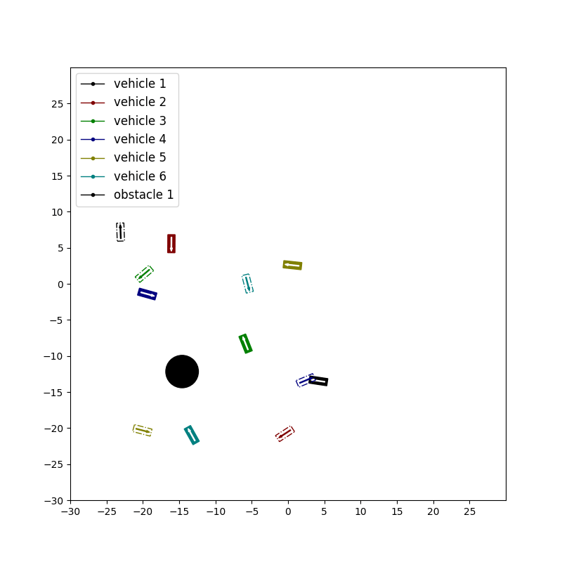

#  Multi-Agent-Control
## Multi-Agent Control in Unconstrained Environments using an Attention basedGraphical Neural Network

This repository contains code for the paper **Multi-Agent Control in Unconstrained Environments using an Attention basedGraphical Neural Network** 

In this work, we propose a learning based neural model that provides control commands to simultaneously navigate multiple vehicles. The goal is to ensure that each vehicle reaches a desired target state without colliding with any other vehicle or obstacle in an unconstrained environment. The model utilizes an attention based Graphical Neural Network paradigm that takes into consideration the state of all the surrounding vehicles to make an informed decision. This allows each vehicle to smoothly reach its destination while also evading collision with the other agents. The data and corresponding labels for training such a network is obtained using an optimization based procedure. Experimental results demonstrates that our model is powerful enough to generalize even to situations with more vehicles than in the training data. Our method also outperforms comparable graphical neural network architectures.


## Environment

Clone the repo and build the conda environment:

```
conda create -n myenv python=3.7 
conda activate myenv
pip install torch==1.11.0+cu113 torchvision==0.12.0+cu113 torchaudio==0.11.0+cu113 -f https://download.pytorch.org/whl/torch_stable.html
pip install --no-index torch-scatter --no-cache-dir -f https://pytorch-geometric.com/whl/torch-1.11.0+cu113.html
pip install scipy
pip install --no-index torch-sparse --no-cache-dir -f https://pytorch-geometric.com/whl/torch-1.11.0+cu113.html
pip install --no-index torch-cluster --no-cache-dir -f https://pytorch-geometric.com/whl/torch-1.11.0+cu113.html
pip install --no-index torch-spline-conv --no-cache-dir -f https://pytorch-geometric.com/whl/torch-1.11.0+cu113.html
pip install torch-geometric==2.0.4
pip install pyyaml
pip install matplotlib
```


## Show Results of our Model 

Here we show videos to show the qualitative results of our approach **in different settings**. Although our model is trained with less than 3 vehicles. It can be will generalized to deal with 6 vehicles.

<table>
  <tr>
    <!-- <td>
      
    </td>
    <td> -->
      
    </td>
  <!-- </tr> -->
  <!-- <tr> -->
    <td>
      
    </td>
    <td>
      
    </td>
  </tr>
</table>


### Show Attention of our Model

The image below shows how the attention changes when the vehicles are moving. We visualize the mean of attention logits from all the graph attention layers of our model. The rows in the attention matrix correspond to the vehicle of interest. The columns show which vehicles/obstacle is being attended to. A lighter shade in the attention matrix depicts high attention and a darker shade represents lack of attention.


### Compare with Other GNN Models

Here we show the comparison of our result with  **GAINet**[1] **TransformerConv**[2], and **EdgeConv**[3]. Our model can drive all the vehicles to the destination without colliding with each other while vehicles always collide with other models.

<table>
  <tr>
    <td>
        <figure>
            
            <figcaption>Our Model</figcaption>
        </figure>
    </td>
    <td>
        <figure>
            
            <figcaption>TransConv</figcaption>
        </figure>
    </td>
  <!-- </tr> -->
  <!-- <tr> -->
    <td>
        <figure>
            
            <figcaption>GAINet</figcaption>
        </figure>
    </td>
    <td>
        <figure>
            
            <figcaption>EdgeConv</figcaption>
        </figure>
    </td>
  </tr>
</table>

<table>
  <tr>
    <td>
        <figure>
            
            <figcaption>Our Model</figcaption>
        </figure>
    </td>
    <td>
        <figure>
            
            <figcaption>TransformerConv</figcaption>
        </figure>
    </td>
  <!-- </tr> -->
  <!-- <tr> -->
    <td>
        <figure>
            
            <figcaption>GAINet</figcaption>
        </figure>
    </td>
    <td>
        <figure>
            
            <figcaption>EdgeConv</figcaption>
        </figure>
    </td>
  </tr>
</table>


[1]: Liu, Y., Qi, X., Sisbot, E. A., and Oguchi, K. **Multi-agent trajectory prediction with graph attention isomorphismneural network**. In 2022 IEEE Intelligent Vehicles Symposium (IV), pp. 273–279, 2022. doi: 10.1109/IV51971.2022.9827155.

[2]: Shi, Y., Huang, Z., Feng, S., Zhong, H., Wang, W., and Sun,Y. **Masked label prediction:  Unified message passing model for semi-supervised classification**. arXiv preprint arXiv:2009.03509, 2020.

[3]: Yue, W., Yongbin, S., Ziwei, L., Sarma, S. E., and Bronstein, M. M. **Dynamic graph cnn for learning on point clouds**. Acm Transactions On Graphics (tog), 38(5), 2019.


## Tool for Visualizing Attention 

Run visualize_attention.py:
```
conda activate myenv
cd $path to this repo$
python visualize_attention.py
```

A window will pump out:


Clicking and draging the vehicle or target can change the position of it. 
Clicking and scrolling the vehicle or target can change the orientation of it.
Moving the slider on the bar can change the corresponding velocity of the vehicle.
Clicking and draging the obstacle can change the position of it.
Clicking and scrolling the obstacle can change the size of it.

You can also change the number of vehicle and num of obstacle in the scene by modifying the problem collection in [configuration](./configs/visualize_attention.yaml#L23)

